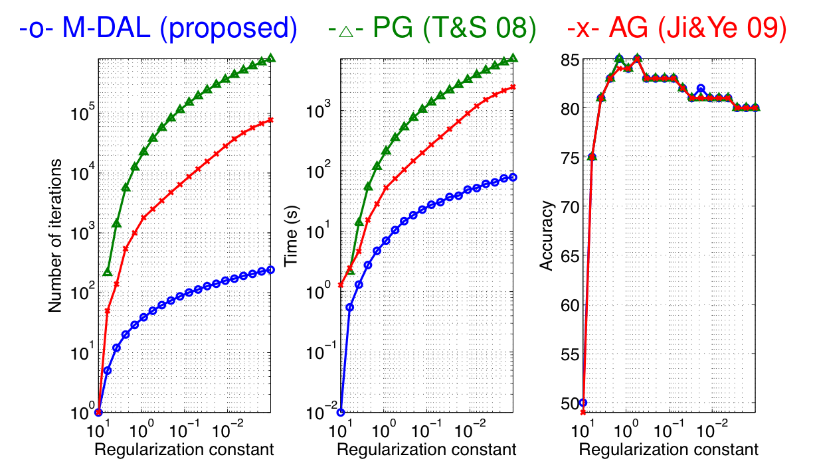

# Support Page for "A Fast Augmented Lagrangian Algorithm for Learning Low-Rank Matrices"

# Demo 1: Low-rank matrix completion
This demo shows that the proposed M-DAL algorithm can perform matrix completion of 10,000x10,000 (rank 10) matrix from 1.2M observations very fast (roughly 5 min on a 3.1GHz Opteron (quad-core) machine)

Before running this demo, you need to mex [[http://soi.stanford.edu/~rmunk/PROPACK/|PROPACK]] routines. On a linux machine what you have to do is (hopefully) just to run the script `setup.m` in the root folder after extracting the archives.
```matlab
 setup
```
If this doesn't work, this demo might be very slow. But you can still run [[#demo2|demo 2]] and [[#demo3|demo 3]] without PROPACK.


To run the algorithm, just type
```matlab
 cd demo1
 demo1
```

The first few lines of the script `demo1.m` looks like this:
```matlab
n=10000;    % size of the unknown matrix
m=1200000;  % number of observations
k=10;       % true rank of the unknown matrix
lambda = [1000 700 500 300 200 150 100];
            % regularization constant
eta=10;     % step-size parameter
nrep=10;    % number of repetition

memo=test_matrix_completion(n,m,k,lambda,eta,nrep);
```

If you also want to try rank 20, just type
```matlab
 k=20;        % True rank of the unknown matrix
 m=2400000;   % Number of observations
 lambda=[2000 1500 1200 1000 700 500 400 300 200 150 120 100];
 memo=test_matrix_completion(n,m,k,lambda,eta,nrep);
```


The output (for the default rank 10) should look like this:
```matlab
lambda   time(s)         #iter_out       #iter_in        #svd            rank            error
----------------------------------------------------------------------------------------------------------------
1000     30.5(± 2.29)    5(± 0)          8(± 0)          32(± 0)         3(± 0)          0.0162(± 0.00369) 
700      71.4(± 4.66)    11(± 0)         18(± 0)         71(± 0)         5(± 0)          0.0132(± 0.00174) 
500      114(± 5.93)     17(± 0)         28(± 0)         110(± 0)        6.40(± 0.516)   0.0112(± 0.00208) 
300      161(± 6.79)     23(± 0)         38.4(± 0.699)   151(± 3.07)     8(± 0)          0.00868(± 0.00065) 
200      202(± 6.50)     29(± 0)         48.4(± 0.699)   190(± 3.07)     9(± 0)          0.0079(± 0.000407) 
150      237(± 6.83)     35(± 0)         58.4(± 0.699)   231(± 3.07)     9(± 0)          0.00519(± 0.000343) 
100      296(± 7.26)     41(± 0)         69.8(± 1.48)    275(± 4.69)     10(± 0)         0.0075(± 0.000209) 
```

# Demo 2: Synthetic matrix classification
The task here is to classify 64 x 64 matrices where the true classifier coefficient is a symmetric rank 16 matrix. The proposed M-DAL algorithm is clearly 10-30 times faster than previous algorithms.

To run the script, just type
```matlab
 cd demo2
 demo2
```

The first few lines of `demo2.m` looks like this:
```matlab
m = 1000;      % Number of samples
n = 64;        % Dimension
k = 16;        % True rank
lambda = 800;  % Regularization constant
algos  = {'dal','lrds','ag','projgrad',};
               % Algorithms
nrep   = 10;   % Number of repetitions

memo = test_matrix_classification(m, n, k, lambda, algos, nrep);
```
If you want to get the results quickly set `nrep` to 2
```matlab
>> nrep = 2;
```
(2 is minimal to compute the standard deviation).

After running the script, you will get a plot like this:

!(demo2)(./64x64.jpg)

Here, AG is the accelerated gradient method proposed in [[http://www.public.asu.edu/~sji03/papers/pdf/Ji_ICML09.pdf|Ji & Ye 2009]], IP is the interior-point algorithm proposed in [[http://www.ibis.t.u-tokyo.ac.jp/ryotat/TomAih07.pdf|Tomioka & Aihara 2007]], PG is the projected gradient method proposed in [[http://www.ibis.t.u-tokyo.ac.jp/ryotat/opt08.pdf|Tomioka & Sugiyama 2008]].

The script for AG method used here differs from the [[http://www.public.asu.edu/~jye02/Software/SLEP/|script]] written by Ji & Ye  only in that it also outputs computation time as follows:
```diff
46c46
< function [Wp,b,fval_vec,itr_counter] = accel_grad_mc(Xtrain,Ytrain,lambda,opt)
---
> function [Wp,b,fval_vec,time_vec,itr_counter] = accel_grad_mc(Xtrain,Ytrain,lambda,opt)
94a95,96
> time_vec = zeros(1,max_itr);
> time0 = cputime;
124a127
>     time_vec(itr_counter) = cputime-time0;
```


# Demo 3: BCI classification with multiple matrices
The task in this experiment is taken from [[http://www.bbci.de/competition/ii/berlin_desc.html|BCI competition 2003 dataset IV]]. The task is to predict the laterality (left or right) of the upcoming finger movement from EEG signal before it is executed.

Each input data is a short segment of multivariate time-series and is stored in a 28 (channels) x 50 (time points) matrix. We preprocessed each input into three matrices as follows (See [[http://dx.doi.org/10.1016/j.neuroimage.2009.07.045|Tomioka & M端ller 2010]] for details)
 * First order component (low-pass filtered at 20Hz) : [28x50]
 * Second order (alpha-band) component (band-pass filtered at 7-15Hz) : [28x28]
 * Second order (beta-band) component (band-pass filtered at 15-30Hz) : [28x28]

This demo comes with preprocessed train-/test- datasets. To run the script, just
```matlab
 cd demo3
 demo3
```

The figure below shows that the proposed M-DAL algorithm is roughly 10-100 times faster than the previous AG and PG approaches; IP was not included because it was not straightforward to extend the IP approach in Tomioka & Aihara (2007) to multiple-matrix case (just concatenating matrices along the diagonal makes the problem-size unnecessarily large and is unpractical).



In the figure, the number of iterations, CPU time, and the test accuracy are plotted against the regularization constant. Note that we use a warm start strategy (i.e., we use the solution obtained for one regularization constant to train the next model with a smaller regularization constant). Accordingly the costs (#steps & CPU time) are accumulated from large lambda to small lambda. All algorithms were terminated when the relative duality gap (= (primal obj - dual obj)/primal obj) fell below 1e-3.

The script `accel_grad_mmc.m` differs from the [original](http://www.public.asu.edu/~jye02/Software/SLEP/) as follows
 * It supports multiple input matrices as cell matrices.
 * It computes duality gap (as a stopping criterion).
 * Some speedups (vectorization).
The exact diff can be found [here](AGDiff.diff).

# Contact
 Any kind of feedbacks (comments, bug reports, etc) are appreciated. Email: tomioka [AT] ttic.edu

# References
 * [[http://www.ibis.t.u-tokyo.ac.jp/ryotat/icml2010.pdf|"A Fast Augmented Lagrangian Algorithm for Learning Low-Rank Matrices"]], __Ryota Tomioka__, Taiji Suzuki, Masashi Sugiyama, and Hisashi Kashima, ''Proc. of the 27 th Annual International Conference on Machine Learning ([[http://www.icml2010.org/|ICML 2010]])'', Haifa, Israel, 2010. [[http://www.ibis.t.u-tokyo.ac.jp/ryotat/icml10talk.pdf|[Slides] ]]
 * [[http://soi.stanford.edu/~rmunk/PROPACK/|PROPACK]]: A fast SVD library written by Rasmus Munk Larsen.
 * [[http://www.public.asu.edu/~sji03/papers/pdf/Ji_ICML09.pdf|"An accelerated gradient method for trace norm minimization"]]. Shuiwang Ji & Jieping Ye, In Proc. ICML 2009. [[http://www.public.asu.edu/~jye02/Software/SLEP/|[Software] ]]
 * [[http://www.ibis.t.u-tokyo.ac.jp/ryotat/opt08.pdf|"Sparse learning with duality gap guarantee"]], __Ryota Tomioka__, Masashi Sugiyama.  In ''NIPS workshop [[http://opt2008.kyb.tuebingen.mpg.de/|OPT 2008]] Optimization for Machine Learning'', 2008.
 * [[http://www.ibis.t.u-tokyo.ac.jp/ryotat/TomAih07.pdf|"Classifying Matrices with a Spectral Regularization"]], __Ryota Tomioka__ and Kazuyuki Aihara, ''Proc. of the 24th Annual International Conference on Machine Learning ([[http://oregonstate.edu/conferences/icml2007/|ICML2007]])'', pp. 895-902, ACM Press. Oregon, USA, June, 2007. [[http://portal.acm.org/popBibTex.cfm?id=1273609&ids=SERIES12439.1273496.1273609&types=series.proceeding.article&reqtype=article&coll=GUIDE&dl=GUIDE&CFID=47356368&CFTOKEN=13660864|[BibTex] ]][[http://www.ibis.t.u-tokyo.ac.jp/ryotat/TomiokaICMLday3.pdf|[Slides] ]][[http://www.ibis.t.u-tokyo.ac.jp/ryotat/lrds|[Software] ]]
 * [[http://dx.doi.org/10.1016/j.neuroimage.2009.07.045|"A regularized discriminative framework for EEG analysis with application to brain-computer interface"]], __Ryota Tomioka__ and Klaus-Robert M端ller, ''[[http://www.elsevier.com/wps/find/journaldescription.cws_home/622925/description#description|Neuroimage]]'', 49 (1) pp. 415-432, 2010.
 * [[http://ieeexplore.ieee.org/xpl/freeabs_all.jsp?arnumber=1300800|The BCI competition 2003: Progress and perspectives in detection and discrimination of EEG single trials.]] B. Blankertz, K.-R. M端ller, G. Curio, T. M. Vaughan, G. Schalk, J. R. Wolpaw, A. Schl旦gl, C. Neuper, G. Pfurtscheller, T. Hinterberger, M. Schr旦der, and N. Birbaumer.  IEEE Trans. Biomed. Eng., 51(6):10441051, 2004. [[http://www.bbci.de/competition/ii/|[Webpage] ]]
